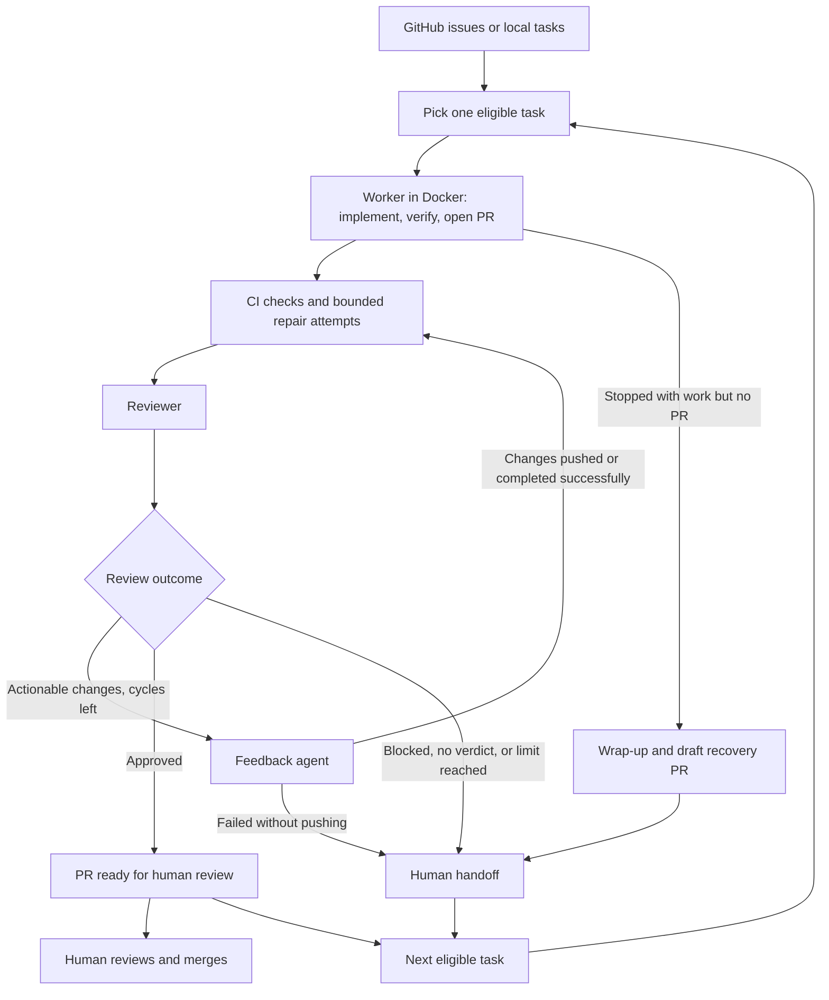

# Alucard

An unattended coding-agent loop that turns GitHub issues or local Markdown tasks into pull requests.

Alucard picks one task, gives an agent an isolated clone in Docker, and runs implementation, CI repair, and code review. You come back to PRs to review and merge, plus explicit handoffs for work that needs you. It supports Claude Code and Codex, with a separate provider and model choice for each role.

This is an experimental personal project, built for my own workflow. Expect rough edges and breaking changes.

[Get started](#get-started) · [Commands](#commands) · [Local tasks](#local-task-source) · [Configuration](#configuration) · [Recovery](#when-a-run-needs-you)

## How it works

1. Add small, well-defined tasks to the queue. Use GitHub issues labeled `ready-for-agent`, or a local tasks file.
2. Run `alucard run`. A worker implements one task, verifies its changes, commits, and opens a PR.
3. Alucard checks CI and runs a fix agent when checks fail. A reviewer then evaluates the PR, and a feedback agent addresses actionable findings.
4. The loop moves to the next task until the queue is empty or the iteration limit is reached. Review stops on approval, a human blocker, a failed feedback attempt with no pushed changes, or the review-cycle limit.
5. You inspect the PRs and merge them. Alucard's agents are instructed to work on branches and never push to `main`; Alucard does not merge PRs.



Each task starts from the configured base branch. Dependencies wait for their blockers to finish, so a run can empty its eligible queue while PRs still await your review or merge.

## Get started

### Prerequisites

- A host with Bash, `git`, `gh`, `jq`, GNU `timeout`, and `sha256sum`. Linux is the simplest setup.
- Docker running and accessible to your user without `sudo`.
- `gh auth login` for host-side repository access.
- A GitHub repository with at least one commit on `main`, or another branch selected with `--base`.
- A GitHub token and an API key for each agent provider you use.

Install `flock` from `util-linux` if you plan to run multiple Alucard processes against the same repository. Alucard uses it to serialize writes to the shared clone.

### Install

```bash
curl -fsSL https://raw.githubusercontent.com/aldovc/alucard/main/install.sh | bash
```

The installer clones Alucard into `~/.local/share/alucard`, links the CLI into `~/.local/bin`, and creates `alucard.env` from the example if it does not already exist. Add `~/.local/bin` to your `PATH` if needed. Re-run the installer to update.

For a different installation directory, pass the variables to the shell running the installer:

```bash
curl -fsSL https://raw.githubusercontent.com/aldovc/alucard/main/install.sh \
  | ALUCARD_HOME="$HOME/tools/alucard" ALUCARD_BIN_DIR="$HOME/bin" bash
```

The examples below use the default location:

```bash
export ALUCARD_HOME="$HOME/.local/share/alucard"
```

### Configure credentials

Edit `$ALUCARD_HOME/alucard.env`. For the default Claude setup, fill in:

```dotenv
GITHUB_TOKEN=your-github-token
ANTHROPIC_API_KEY=your-anthropic-api-key
```

Use a fine-grained GitHub PAT restricted to the target repository, with these repository permissions:

| Permission | Access | Used for |
|---|---|---|
| Contents | Read and write | Fetching and pushing branches |
| Issues | Read and write | Reading, claiming, and updating GitHub tasks |
| Pull requests | Read and write | Opening PRs and posting review results |
| Actions | Read | Reading workflow runs and failed-job logs |
| Metadata | Read | Repository metadata |

Local tasks using only task-id dependencies can omit Issues access. Legacy `Blocked by #N` references still need Issues read access. Use short-lived tokens and dedicated provider keys with spending limits set in the provider console.

If the token cannot access the PR checks API, Alucard falls back to `gh run list` for that run. That path needs Actions read access. If no checks or current-commit workflow runs are visible after polling, Alucard logs a skip and proceeds to review. A skipped CI gate is not evidence that tests passed.

For Codex, set `ALUCARD_PROVIDER=codex` and `OPENAI_API_KEY` in the env file. You only need `ANTHROPIC_API_KEY` when at least one role uses Claude. See [Configuration](#configuration) for mixed-provider setups.

### Prepare the target repository

Alucard lives outside the repository it works on. It accepts a local clone, `owner/repo`, or a GitHub HTTPS URL. GitHub references are cloned into `~/.cache/alucard` on first use.

Add these entries to the target repository's `.gitignore`:

```gitignore
.alucard-worktrees/
.alucard/tasks.md
```

For the GitHub issue queue, create the labels once. Replace `owner/repo` with your repository:

```bash
for label in ready-for-agent ready-for-human in-progress wip alucard needs-human; do
  gh label create "$label" --repo owner/repo --force
done
```

Configure branch protection in GitHub to enforce your merge requirements. All agent roles currently share one GitHub identity, so an agent's `APPROVED` verdict is recorded in a comment when GitHub rejects self-review. It does not satisfy a required approval from another reviewer.

### Run your first task

Build the image and check the setup:

```bash
alucard build
alucard doctor owner/repo
```

Create a small issue, such as adding a changelog to a repository that does not have one:

```bash
gh issue create --repo owner/repo --label ready-for-agent \
  --title "Add a changelog" \
  --body 'Add CHANGELOG.md at the repository root with an Unreleased section.
Link it from README.md. No application behavior should change.'
```

Use the issue number returned by GitHub:

```bash
alucard run owner/repo --issue 123 --timeout-minutes 15
```

`--issue` runs exactly one open GitHub issue, regardless of queue labels or local-task auto-detection. It is useful for a first run or a deliberate retry.

The console streams agent activity and prints the log directory. Inspect the resulting PR, its CI status, and Alucard's review comments. The timeout applies to each agent invocation, so the complete implementation and review pipeline can take longer than 15 minutes.

## Commands

```bash
# Inspect the eligible queue as JSON
alucard queue owner/repo

# Work through the queue, up to 20 iterations
alucard run owner/repo --iterations 20 --timeout-minutes 30

# Run one open GitHub issue
alucard run owner/repo --issue 90

# Use a local clone and a local tasks file
alucard run /path/to/repo --tasks /path/to/repo/.alucard/tasks.md -n 1

# Force GitHub issues even if a local tasks file exists
alucard run /path/to/repo --github

# Check prerequisites and validate a local tasks file
alucard doctor /path/to/repo

# Address PR comments, then re-run CI and review
alucard continue 174 owner/repo

# Show all options or the installed CLI version
alucard --help
alucard version
```

The target defaults to the current directory. You can also select it with `--repo` or `ALUCARD_TARGET_REPO`.

| Option | Default | Purpose |
|---|---|---|
| `-n`, `--iterations` | `20` | Maximum worker iterations per run |
| `-t`, `--timeout-minutes` | `30` | Timeout for each agent invocation and dependency preflight |
| `--base` | `main` | Base branch on `origin` |
| `--max-review-cycles` | `10` | Maximum reviewer cycles per PR |
| `--env-file` | `alucard.env` beside the CLI | Credentials and agent settings |
| `--image` | `ghcr.io/aldovc/alucard:latest` | Container image |
| `--logs-root` | `logs/` beside the CLI | Run logs and measurements |
| `--no-build` | Off | Use an existing image without rebuilding; warn if stale |

`--issue` is valid only for `run`. It forces the GitHub task source and cannot be combined with `--tasks`. `--tasks` and `--github` are also mutually exclusive.

## Task sources

### GitHub issues

The default queue contains open issues labeled `ready-for-agent`. Alucard filters out issues labeled `in-progress` or `wip`, blocked issues, and issues already referenced by an open PR. Keep human work labeled `ready-for-human` instead of `ready-for-agent`. Use `Blocked by #N` in an issue body to declare a dependency on another issue.

The worker picks one eligible issue and labels it `in-progress`. Complete work uses `Closes #N` in the PR body; partial work uses `Refs #N`. The issue closes when a complete PR merges. In queue mode, a worker that judges an issue too large proposes a split in an issue comment and moves it to `ready-for-human`.

Write tasks with observable acceptance criteria and enough context to work independently. No authoring skill or template is required. `/to-spec` and `/to-tickets` are optional helpers; this repository includes a [to-tickets skill](.claude/skills/to-tickets/SKILL.md).

### Local task source

Alucard can read a host-side Markdown file instead of GitHub issues. PRs still live on GitHub. The file is a local task ledger and should stay gitignored.

Select it with `--tasks PATH` or `ALUCARD_TASKS_FILE`. If neither is set, Alucard automatically uses `.alucard/tasks.md` when it exists in the target repository. `--github` overrides both configured and auto-detected local files.

Everything above the first task heading is shared parent context, passed to workers and reviewers. Each heading has the form `## [<state>] <id>: <title>`. Its body continues until the next task heading and can contain ordinary Markdown headings.

```markdown
# Widget export

Add CSV export to the existing /api/widgets/export endpoint.
Preserve its current JSON response and authentication rules.

## [ ] 1: Add a CSV response format

### Acceptance criteria

- [ ] ?format=json returns the existing JSON shape.
- [ ] ?format=csv returns CSV with a header row.
- [ ] An unsupported format returns a validation error.

Blocked by: none

## [h] 2: Decide the export rate limit

Choose the limit before enabling export for all users.

Blocked by: none

## [ ] 3: Add a Download CSV button

Use the export endpoint with format=csv.

Blocked by: 1
```

| State | Meaning |
|---|---|
| `[ ]` | Queued, eligible when dependencies are complete |
| `[>]` | PR in flight, with `(PR #N)` appended to the title |
| `[x]` | Done |
| `[h]` | Human task, never dispatched |

File order determines queue order. In the example, only task `1` is eligible. Task `3` waits until task `1` reaches `[x]`.

Use `Blocked by: 1, 2` for task-id dependencies, or `Blocked by: none`. Legacy `Blocked by #N` lines refer to GitHub issues and require Issues read access.

When a worker opens a PR, Alucard changes the task to `[>]`. The PR starts with `Task: <id>` rather than a GitHub issue-closing keyword. On the next queue build, merged PRs move to `[x]`; closed, unmerged PRs return to `[ ]` with the previous PR recorded. Open PRs stay in flight. A GitHub API failure leaves the task file untouched.

`alucard doctor` reports malformed headings, missing parent context, duplicate ids, and dangling task dependencies with line numbers. `alucard queue` reconciles PR state and shows eligible tasks. Run only one process against a given local tasks file.

## Configuration

Use [alucard.env.example](alucard.env.example) as the reference for provider, model, effort, and per-role settings. Claude defaults to `sonnet` with `haiku` as fallback. Codex defaults to `gpt-5.6-terra`.

For example, these settings in `alucard.env` use Claude for implementation and Codex for review:

```dotenv
ALUCARD_PROVIDER=claude
ALUCARD_REVIEWER_PROVIDER=codex
ALUCARD_REVIEWER_CODEX_MODEL=gpt-5.6-terra
```

Per-role settings use `WORKER`, `CI_FIX`, `REVIEWER`, or `FEEDBACK`, and fall back to the corresponding global setting. The wrap-up agent uses the worker's provider and model.

### Limits and cost

Claude receives a turn and dollar budget for each invocation:

| Role | Max turns | Max budget, USD |
|---|---|---|
| Worker | 180 | 10 |
| CI fix | 30 | 2 |
| Reviewer | 45 | 2 |
| Feedback | 50 | 2 |
| Wrap-up | 12 | 1 |

Override these with `ALUCARD_<ROLE>_MAX_TURNS` and `ALUCARD_<ROLE>_MAX_BUDGET`. The wrap-up settings use `WRAPUP`; `ALUCARD_WRAPUP_MAX_TURNS=0` disables it. Claude agents see their turn budget in the prompt so they can commit work before it runs out.

These turn and dollar caps do not apply to Codex. The container timeout applies to both providers. Budgets are per invocation, not per PR or run; retries and review cycles add to the total.

`ALUCARD_TRANSPORT_RETRY_ATTEMPTS` defaults to `2` extra attempts for retryable worker and reviewer failures. Connection drops and missing container checkouts get fresh clones within that budget.

### Container and toolchain

The image includes Node 24, Python 3.12, `uv`, `just`, `git`, `gh`, Claude Code, Codex, ShellCheck, native build tools, and Playwright Chromium.

Before dispatching agents, dependency preflight checks Python projects with `uv sync` and npm projects with `npm ci`. For each ecosystem, a root manifest takes precedence over nested manifests. Without a root manifest, preflight checks every matching manifest one directory level down. It records the install commands, directories, and results in `toolchain-preflight.txt` and passes them to workers, reviewers, and feedback agents.

Preflight verifies dependency installation only. Agents still need to follow the target repository's verification workflow and report tests they ran separately from checks they could not run. Service-backed checks assigned to CI remain CI's responsibility.

Playwright browsers are cached across containers under `~/.cache/alucard/playwright-browsers`. Preflight seeds the cache from the image and installs Chromium for the target repository's own Playwright version when detected. Different revisions coexist; preflight reports version mismatches. `ALUCARD_CACHE_DIR` relocates both repository and browser caches, and the default honors `XDG_CACHE_HOME`. You can prune the browser cache between runs; preflight recreates it.

`alucard build` stamps the image with a hash of `Dockerfile` and `entrypoint.sh`. Runs rebuild missing, unstamped, or stale images from the installed CLI source. Successful rebuilds also try to remove a superseded image if it has no remaining tags. `--no-build` keeps an existing image with a warning, but fails if the image is missing.

To use a custom image, edit the Dockerfile in your Alucard checkout and build with an explicit tag:

```bash
alucard build --image myproject/alucard:dev
alucard run owner/repo --image myproject/alucard:dev -n 1
```

You can also select the image with `ALUCARD_IMAGE`. Prebuilt images are available from `ghcr.io/aldovc/alucard`; see [Releases](#releases).

### Engineering and review policy

Workers, reviewers, and feedback agents share [alucard-engineering-policy.md](alucard-engineering-policy.md). It asks for the smallest correct change, reuse of existing patterns, and tests for distinct behavior and failure modes. Existing coverage counts. File-size limits and ticket estimates are caps, not targets. Design rationale belongs in specs, commits, or PRs; comments explain contracts and non-obvious constraints.

Reviewers must name a concrete defect, violated contract, or maintenance problem before asking for more structure or tests. Optional suggestions do not automatically become feedback-agent work. CI-fix has its own narrower instructions to repair the failing check.

A root `REVIEW.md` in the target repository adds repository-specific review guidance to reviewer and feedback prompts. It can define review passes, severity thresholds, and excluded finding classes. It cannot override verdicts or instruct approval. Alucard includes up to 16 KiB by default, with a truncation marker; `REVIEW_POLICY_MAX_BYTES` changes the cap.

## When a run needs you

### CI and review outcomes

Each CI gate makes up to three check attempts, with at most two fix-agent runs between them. CI still failing after that leaves the PR open and is recorded in the logs; the reviewer still runs. Each check attempt polls for up to 45 minutes.

| Review outcome | What happens |
|---|---|
| `APPROVED` | Review ends. Inspect CI and the diff before merging. |
| `CHANGES_REQUESTED` | Feedback addresses actionable findings, then CI and review repeat while cycles remain. |
| `BLOCKED` | Work needs something an agent cannot do, such as a credential or human acceptance step. Alucard posts the reason and labels the PR `needs-human`. |
| Review-cycle limit reached | Alucard posts an exhaustion comment and labels the PR `needs-human`. |
| No reviewer verdict | After applicable retries, Alucard reports the failure and labels the unreviewed PR `needs-human`. |
| Feedback failed without pushing changes | Alucard stops rather than reviewing the same commit again and labels the PR `needs-human`. |

Reviewers read earlier findings and replies. Findings the feedback agent cannot resolve are recorded in a blocked-findings comment and passed to later reviewers, including on subsequent runs. This keeps a known human blocker from consuming every remaining cycle.

To address PR feedback and run the gates again:

```bash
alucard continue 174 owner/repo
```

`continue` uses the latest Alucard change request plus subsequent human comments, or all human comments if there is no change request. Without actionable comments it runs CI and review only. It does not restart the original implementation task.

### Worker recovery

If a worker stops with work but no PR, Alucard attempts to preserve it in a draft `wip: alucard recovery` PR labeled `needs-human`. For turn or budget exhaustion and ordinary agent failures, a short wrap-up agent first commits the remaining work and writes a handoff describing what is done, remaining, and unverified. The orchestrator then commits any leftovers, pushes the branch, and opens the recovery PR. Other stop conditions use mechanical recovery without the wrap-up agent.

For GitHub tasks, recovery removes `in-progress`, links the PR from the issue, and uses `Refs #N` instead of closing the issue. An explicitly pinned issue remains the attribution even if the worker stopped before claiming it.

Finish the work on the recovery branch, then run `alucard continue <PR>` to address feedback and repeat CI and review. When the review gate approves the current head, Alucard marks its recovery PR ready, removes `needs-human`, changes `Refs #N` to `Closes #N`, and replaces the stub title with the issue's title. It identifies recovery PRs by a marker comment from the authenticated harness account, or by that account's authorship of a draft still carrying the recovery stub title and `needs-human`. If marking the draft ready fails, the label stays and the approval comment explains the manual steps.

Alternatively, close the PR to let the task rejoin the queue. `alucard run --issue N` starts a fresh attempt immediately. For local tasks, closing an unmerged recovery PR returns the task to the queue on reconciliation.

The run's final `Needs attention` list includes recovery PRs and issues parked for a human. An empty eligible queue does not mean every task is complete.

### Concurrent runs

Separate processes can work on different pinned issues or continue different PRs in the same repository. Each run has its own log directory, clone directory, and branch names. Branches include the run id and, when known at dispatch, the issue number or local task id. CI, review, and usage reporting stay bound to the PR identified for that worker, including when it renames its branch.

Writes to the shared source clone use `flock`; without it, Alucard warns and proceeds unlocked. Containers receive an explicit GitHub repository context, and a missing checkout is treated as a runner failure with a fresh-clone retry.

Queue claims are not atomic. For parallel workers, use `--issue` with a different issue per process. Avoid concurrent runs on the same PR or local tasks file.

## Isolation and permissions

Agents run without interactive permission prompts. Docker provides the isolation boundary:

- A read-only container root, dropped Linux capabilities, and `no-new-privileges`.
- Containers run as the invoking user's UID and GID, with temporary home and `/tmp` directories.
- Each container has a 4 GiB memory limit and a two-CPU limit.
- Agents work in disposable clones under `.alucard-worktrees/<run>/`. Cleanup removes only the current run's directories.
- Writable mounts include the working clone, role output directories where needed, and the shared browser cache.

Agents have network access and receive the configured credentials. Isolation does not prevent credential exfiltration or misuse of the GitHub token. Scope credentials to the work and use branch protection to enforce repository rules. Claude also gets a small command blacklist, which is not the isolation boundary.

## Logs and measurements

Each run writes to `logs/alucard-*/` beside the CLI unless you set `--logs-root` or `ALUCARD_LOG_ROOT`.

| Path within the run directory | Contents |
|---|---|
| `events.log` | Timestamped run, iteration, and gate transitions |
| `iter-*.jsonl` | Agent output and usage records |
| `toolchain-preflight.txt` | Dependency-install results |
| `measurements.jsonl` | Run configuration, diff measurements, and iteration outcomes |
| `prompts/` | The actual prompts dispatched to agents |

For example, compare code growth across stages:

```bash
jq -r 'select(.record=="stage")
       | "\(.iter) \(.stage)/\(.cycle)  +\(.from_base.added) since base"' \
  "$ALUCARD_HOME"/logs/alucard-*/measurements.jsonl
```

Measurements contain three record types:

- `run` records the runner revision, prompt digest, image ID, and per-role provider and model settings.
- `stage` measures worker, CI-fix, and feedback changes against the iteration's base and previous stage. Changes are grouped as tests, implementation, configuration/docs, and generated files, with paths retained. `baseline_source` and `base_drifted` describe the comparison base; an unavailable diff is marked explicitly.
- `iteration` records CI result, review verdict, cycles, elapsed time, and token usage by role. Cost is `null` when the provider reports none. `cost_complete`, invocation counts, and `usage_missing` distinguish complete totals from partial data.

Measurements and archived prompts stay local. Alucard also posts usage summaries on PRs. Measurement failures are logged and do not stop the run.

## Development

The Bash CLI in [`alucard`](alucard) manages queues, clones, containers, and PR gates. [`entrypoint.sh`](entrypoint.sh) sets up container-side Git and GitHub authentication. Role instructions live in `alucard-*-prompt.md`, including separate worker modes and the recovery wrap-up prompt.

Read [AGENTS.md](AGENTS.md) and the [engineering policy](alucard-engineering-policy.md) before making changes. The CI checks are:

```bash
for t in test/test_*.sh; do
  bash "$t" </dev/null || exit 1
done

shellcheck --severity=warning --exclude=SC2034 \
  alucard entrypoint.sh install.sh test-*.sh test/*.sh
```

For prompt changes, run `bash test/test_engineering_policy.sh` to verify prompt assembly.

## Releases

The [publish workflow](.github/workflows/docker-publish.yml) builds images on pushes to `main` and tags matching `v*.*.*`.

| Image tag | Meaning |
|---|---|
| `ghcr.io/aldovc/alucard:vX.Y.Z` | Release tag |
| `ghcr.io/aldovc/alucard:vX.Y` | Latest published patch in that minor version |
| `ghcr.io/aldovc/alucard:vX` | Latest published release in that major version |
| `ghcr.io/aldovc/alucard:latest` | Most recently published image, whether from `main` or a release tag |
| `ghcr.io/aldovc/alucard:<short-sha>` | Image for a specific source commit |

To use a published image without the CLI rebuilding it against local source:

```bash
docker pull ghcr.io/aldovc/alucard:latest
alucard run owner/repo --image ghcr.io/aldovc/alucard:latest --no-build -n 1
```

Substitute a release tag to select a release. Keep the CLI checkout aligned with that release's prompts and behavior. `alucard version` prints the CLI's `git describe` version, or its short commit SHA when no tag is available.

## Acknowledgements and license

Alucard follows the Ralph-style unattended worker-loop pattern. The optional `/to-spec` and `/to-tickets` authoring workflow is derived from [mattpocock/skills](https://github.com/mattpocock/skills).

[MIT license](LICENSE).
