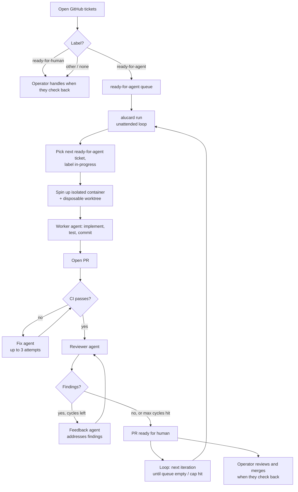

# Alucard, autonomous worker loop

> **Experimental, personal project.** This is built for my own workflow and goals. It works for me but has no stability guarantees, no support commitment, and will change without notice. Use at your own risk.

## What it is

A containerized agent loop that picks work off a queue, completes it one item at a time in isolated git clones, opens PRs, and runs unattended. The queue is GitHub issues labeled `ready-for-agent`, or a [local tasks file](#local-task-source). `ready-for-human` is left for you. How work gets onto the queue is your business.

1. **Tickets exist** on the target repo, labeled `ready-for-agent`. Write them by hand, or use whatever authoring skills you already have. `/to-spec` then `/to-tickets` is one optional path, derived from [mattpocock/skills](https://github.com/mattpocock/skills).
2. **Alucard runs unattended.** It pulls the ready-for-agent queue, picks one, implements, tests, commits, opens a PR, and repeats until the queue is empty or the iteration cap is hit.
3. **CI gate.** After a PR is opened, Alucard polls CI and launches a fix agent (up to 3 attempts) if checks fail.
4. **Review gate.** A reviewer agent evaluates the PR, then a feedback agent addresses findings, repeating up to `--max-review-cycles` times (default 10). The loop ends early on `APPROVED` or `BLOCKED`. See [Loop convergence](#loop-convergence).
5. **You review PRs when you check back** and merge what's good.

Before the first iteration, a **toolchain preflight** checks that the container can actually install the target repo's dependencies (`uv sync` / `npm ci`, detected at the repo root or one level down). Alucard prints the result at startup, saves it to `toolchain-preflight.txt` in the log directory, and passes it to every reviewer.

The build stamps the image with a hash of the `Dockerfile` and `entrypoint.sh` that produced it, and rebuilds automatically when they change. An existing tag is not proof the image is current. A Dockerfile fix sitting inert behind a cached tag is how the toolchain stayed broken for 25 review cycles. `--no-build` warns instead of rebuilding.

Alucard never pushes to main. Each iteration produces an independent PR.

## Flow



## Architecture

- **CLI / host orchestrator** (`alucard`). Bash CLI that loops, manages isolated git clones on the host, queries the GitHub issue queue, and shells out to `docker run` per iteration.
- **Container** (Dockerfile + entrypoint). Disposable per agent run. Opinionated personal image: Node 24, git, gh, uv, just, Python 3.12, Claude Code, Codex, shellcheck, and build-essential (native extensions). Extend it with a local image (`alucard build --image …` / `ALUCARD_IMAGE`), not by shrinking the published one. Worker, CI-fix, reviewer, and feedback each get their own container.
- **Agent prompts.** One file per role: `alucard-worker-prompt.md` (main worker, mode-agnostic core, assembled at dispatch with `alucard-worker-github-prompt.md` or `alucard-worker-local-prompt.md` depending on the task source), `alucard-reviewer-prompt.md` (code reviewer), `alucard-ci-fix-prompt.md` (CI failure fixer), `alucard-feedback-prompt.md` (review feedback handler).
- **Queue.** GitHub issues labeled `ready-for-agent`, or a [local tasks file](#local-task-source). Authoring skills are not part of the runner.

## Loop convergence

The review gate can end five ways:

| Verdict | What it means | What happens |
|---|---|---|
| `APPROVED` | Nothing merge-blocking left. | Loop ends, PR ready to merge. |
| `CHANGES_REQUESTED` | Merge-blocking issues **a feedback agent can fix in the container**. | Feedback agent runs, then the next cycle. |
| `BLOCKED` | Code work is done; merge is gated on something no agent can do, a human-only acceptance criterion, a live deploy, a credential the container does not hold. | Loop ends, PR labeled `needs-human`, reviewer's reasoning posted. |
| *(cycles exhausted)* | The loop hit `--max-review-cycles`. | PR left open for manual review. |
| *(no verdict)* | The reviewer produced neither a formal review nor a `.alucard-review` file — it ran out of turns or budget, wedged, or lost its connection on every attempt. | Loop ends, PR labeled `needs-human`, with the failure class and what to raise. A transport drop is retried first (`ALUCARD_TRANSPORT_RETRY_ATTEMPTS`). |

Without `BLOCKED`, the loop had only two ends: approval or exhaustion. A finding no agent could act on was re-reported until the budget ran out. [zodiac#40](https://github.com/aldovc/zodiac/pull/40) is the failure mode this fixes. 25 review cycles across 4 runs, ~20 of them re-reporting the same "trigger the Cloud Scheduler job manually and attach production evidence" finding into a container with no `gcloud`. Zero approvals. The feedback agent eventually drifted into rewriting unrelated production logic, because that was the only thing it *could* change.

A no-verdict cycle used to `return 0` after a one-line "no review posted (rc=N)" comment, so a PR that was never reviewed looked the same as one that passed every gate — [zodiac#122](https://github.com/aldovc/zodiac/pull/122) hit this when the reviewer exhausted its 20-turn cap mid-orientation. It is now labeled `needs-human` like any other outcome a human has to pick up, and the reviewer's turn cap defaults to 45.

Three mechanisms keep the loop converging:

- **Blocked-findings ledger.** When the feedback agent hits a finding it cannot action, it writes `/work-output/.alucard-blocked` instead of posting a "blocked" comment. The harness posts that once as a `**🤖 Alucard blocked findings**` marker comment and feeds it to every later reviewer as `<known_blockers>`. Reviewers are told not to re-report those. The harness reloads the ledger from the PR at the start of each run, so a re-run does not rediscover it.
- **Reviewers read the conversation.** Each reviewer reads prior cycles' findings and the feedback agent's replies before judging, so they don't raise a finding that's already fixed or already recorded as blocked, just at a new line number.
- **Toolchain status.** Reviewers are told whether the container can install dependencies at all. When it cannot, they review the tests as written but do not demand test *output* no agent on the PR could produce.

## Threat model and safety design

**The risk.** `claude` runs in `bypassPermissions` mode, no prompts, full tool access, so the agent doesn't get stuck mid-run on a missing tool permission. Without isolation, a confused or prompt-injected agent could `rm -rf` your home directory or exfiltrate credentials.

**The defenses, layered.**

1. **Kernel boundary (primary).** Docker container with `--read-only` root, `--cap-drop ALL`, `--security-opt no-new-privileges`, dedicated unprivileged user. Filesystem damage stays inside the bind-mounted worktree. The host's `/home`, `/etc`, dotfiles, and other repos are unreachable.
2. **Resource caps.** `--memory 4g --cpus 2`. A runaway loop can't OOM the host.
3. **Disposable worktrees.** Each iteration gets a fresh worktree at `${REPO}/.alucard-worktrees/iter-N`. The orchestrator removes it after each iteration. An `EXIT` trap handles interrupted runs.
4. **PR-only output.** The agent never pushes to main. Branch protection on main as belt-and-suspenders.
5. **Credential scoping.** GitHub token is a fine-grained PAT, single repo, 30-day expiry. Anthropic and OpenAI keys are dedicated worker keys with a monthly budget cap set in the console.
6. **Pattern blacklist (last line).** `--disallowedTools` removes obvious foot-guns like `rm -rf /*`, `sudo`, `curl | sh`. Pattern-matching is leaky but cheap.
7. **Hard caps per iteration.** Worker: `--max-turns 180`, `--max-budget-usd 10`, `timeout 30m`. CI-fix 30/$2, reviewer 45/$2, feedback 50/$2. All except the timeout are overridable via `ALUCARD_*` env vars. See `alucard.env.example`.

The image is stamped with a `alucard.build-inputs` label — a digest of `Dockerfile` + `entrypoint.sh`. Every run compares it and rebuilds when it drifts, so a Dockerfile fix cannot sit inert behind a cached tag. A rebuild also removes the image it supersedes, which would otherwise be orphaned as ~1.6GB of dangling layers; the old image is kept if another tag still points at it, if the rebuild was fully cached (same image ID), or if the build failed.

**What's still possible.** Credential exfiltration via network, bounded by token scoping. Worst case, an attacker gets push access to one repo for up to 30 days. Recoverable.

## File layout

```
alucard/
├── README.md                    # this file
├── alucard                      # CLI
├── Dockerfile                   # node:24.14.0-slim + git + gh + uv + just + Python 3.12 + claude/codex + alucard user
├── entrypoint.sh                # configures git identity and gh auth at container start
├── alucard-worker-prompt.md     # worker agent instructions (mode-agnostic core)
├── alucard-worker-github-prompt.md  # worker mode section: GitHub tickets queue
├── alucard-worker-local-prompt.md   # worker mode section: local tasks file
├── alucard-reviewer-prompt.md   # reviewer agent instructions
├── alucard-ci-fix-prompt.md     # CI-fix agent instructions
├── alucard-feedback-prompt.md   # review-feedback agent instructions
├── alucard.env.example          # template for credentials (real one is gitignored)
├── test/                        # bash unit tests — `for t in test/*.sh; do bash "$t"; done`
├── .claude/skills/to-tickets/   # optional authoring helper, not required to run
└── .gitignore                   # ignores alucard.env and logs/
```

The target repo (the one Alucard works on) needs:

```
target-repo/
├── .gitignore                   # add: .alucard-worktrees/
└── (your code)
```

Alucard lives in its own folder so you can reuse it across projects. Point the CLI at a target repo with a positional path, `--repo`, or `ALUCARD_TARGET_REPO`. The target repo does not need Alucard skills installed.

## Local task source

GitHub issues are the default queue. Alucard can also read tasks from a plain markdown file. No issue tracker, no per-repo labels, no `Issues` PAT scope. Useful for personal repos where opening a GitHub issue per planning slice is more ceremony than the work deserves.

### Format

One file per plan, by default `.alucard/tasks.md` inside the target repo. Gitignored. A host-side ledger, never committed or pushed. Everything above the first task heading is the plan's shared **parent context**. Alucard injects it verbatim into every worker and reviewer prompt, so individual tasks stay terse without drifting from the plan. Each `## [<state>] <id>: <title>` heading starts a task. Everything until the next task heading is its free-form body.

States:

| State | Meaning |
|-------|---------|
| `[ ]` | Queued, eligible for the next iteration |
| `[>]` | PR in flight. The harness appends `(PR #N)` to the title when it dispatches the task |
| `[x]` | Done |
| `[h]` | Human task (`ready-for-human`). Never queued, but kept in the file so the whole plan lives in one artifact |

A task can declare dependencies with a bare `Blocked by:` line in its body, comma-separated task ids, or `none`. The harness also honors the legacy `Blocked by #N` GitHub-issue form. An open blocker issue keeps the task blocked. File order is queue order. Reprioritizing is moving lines, not relabeling.

**Worked example** (`.alucard/tasks.md`):

```markdown
# Widget export — CSV and JSON

Ship a CSV/JSON export for the widget list. Reuse the existing
`/api/widgets` endpoint; no new query params beyond `format`.

## [ ] 1: Add `format` query param and CSV/JSON serializers

## What to build

Extend `/api/widgets/export` to accept `?format=csv|json`.

## Acceptance criteria

- [ ] `?format=json` returns the existing JSON shape unchanged
- [ ] `?format=csv` returns a CSV with a header row

Blocked by: none

## [h] 2: Decide whether export is rate-limited

Large lists could make this endpoint expensive — cap, paginate, or rate-limit?

Blocked by: none

## [ ] 3: Add a "Download" button

Blocked by: 1
```

`alucard queue` against this file returns exactly task `1`. Task `2` is human (never queued) and task `3` stays blocked until task `1` reaches `[x]`.

### Flags and auto-detection

- `--tasks PATH` / `ALUCARD_TASKS_FILE` uses this tasks file instead of the GitHub queue.
- Auto-detect: with neither flag set, `alucard` looks for `.alucard/tasks.md` in the target repo and switches to it automatically.
- `--github` forces the GitHub issue queue even when a local tasks file is present or configured. Combining `--tasks` and `--github` is an error.
- `alucard doctor` validates the file structurally (duplicate ids, dangling `Blocked by:` references, empty header, malformed headings) with line numbers, before a run ever starts.

### Lifecycle / morning-after flow

- Each iteration, the harness picks the first eligible (`[ ]`, unblocked) task itself and hands the worker exactly that one task plus the parent context. There is no queue to pick from, so bundling is structurally impossible.
- There is no claim/label step in local mode, and no `in-progress` label. Runs are sequential, so nothing else can grab the same task mid-run. Local task blockers should use task ids (`Blocked by: 1, 2`). Legacy `Blocked by #N` issue blockers still require `gh issue view` access so open GitHub issues can keep tasks blocked.
- When a PR opens, the harness flips the task's heading from `[ ]` to `[>] … (PR #N)`. One atomic line edit.
- The PR body's first line is `Task: <id>`, never a GitHub closing keyword. Task ids aren't issue numbers, and a stray `Closes #N` would close an unrelated issue in the target repo.
- At queue build, the harness reconciles `[>]` headings against GitHub. Merged PRs flip to `[x]` and keep `(PR #N)`. Closed unmerged PRs flip back to `[ ]` with `(previous attempt: PR #N)`, so the task rejoins the queue. Open PRs are left alone. A `gh` failure leaves the file untouched.
- `alucard queue` shows exactly what the next iteration would pick up. The file doubles as the morning-after dashboard.

### Reduced PAT scope

Local mode can run without the GitHub Issues API when local tasks use task-id blockers exclusively (`Blocked by: 1, 2`). In that case, the fine-grained PAT described in [Credentials to provision](#credentials-to-provision) needs only Contents R/W, Pull requests R/W, and Metadata R. Drop `Issues R/W`. If any local task uses the legacy `Blocked by #N` GitHub-issue form, keep Issues read access so the queue can resolve whether that issue is still open.

## Setup checklist for the new folder

### Prerequisites on the host

- Docker installed and the user in the `docker` group (or `sudo` available)
- `git`, `gh`, `jq` installed on host (host orchestrator uses them for queue inspection)
- `gh auth login` already done as the human user (separate from the container's auth)
- The target repo cloned locally with at least one commit on `main` and a remote on GitHub

### Install the CLI

```bash
curl -fsSL https://raw.githubusercontent.com/aldovc/alucard/main/install.sh | bash
```

This clones the repo into `~/.local/share/alucard`, symlinks the `alucard` CLI into `~/.local/bin`, and writes a credential template to `~/.local/share/alucard/alucard.env`. Override defaults with env vars:

```bash
ALUCARD_HOME=~/tools/alucard ALUCARD_BIN_DIR=~/bin curl -fsSL https://raw.githubusercontent.com/aldovc/alucard/main/install.sh | bash
```

Re-run the same command to update an existing install.

The rest of this README uses `$ALUCARD_HOME` for the install path (`~/.local/share/alucard` by default).

Use it from anywhere:

TARGET_REPO can be a local path, `owner/repo` (cloned into `~/.cache/alucard` on first run), or a GitHub HTTPS URL.

```bash
alucard run /path/to/target-repo --iterations 1 --timeout-minutes 10
alucard queue /path/to/target-repo
alucard doctor /path/to/target-repo
alucard continue 174 /path/to/target-repo
```

### Credentials to provision

Create the local env file:

```bash
cp "$ALUCARD_HOME/alucard.env.example" "$ALUCARD_HOME/alucard.env"
```

1. **GitHub fine-grained PAT.**
   - github.com → Settings → Developer settings → Personal access tokens → Fine-grained
   - Repository access: only the target repo
   - Permissions: Contents R/W, Issues R/W, Pull requests R/W, Metadata R
   - Expiry: 30 days
   - Paste into `alucard.env` as `GITHUB_TOKEN=`
   - Fine-grained PATs cannot access the GitHub GraphQL `statusCheckRollup` field. GitHub has not shipped a "Checks" permission for fine-grained tokens ([known limitation](https://github.com/cli/cli/issues/12597)). Alucard detects this and falls back to polling `gh run list`, which works. If you want the primary `gh pr checks --watch` path, use a classic PAT with `repo` scope instead.
   - **Local task source.** Running a repo exclusively off a [local tasks file](#local-task-source) instead of GitHub issues needs only Contents R/W, Pull requests R/W, Metadata R. Drop `Issues R/W` only when local tasks use task-id blockers exclusively. Keep Issues read access for legacy `Blocked by #N` issue blockers.

2. **Anthropic worker API key.**
   - console.anthropic.com → API keys → create new key named "alucard-worker"
   - In the workspace settings, set a monthly spend cap (e.g. $50)
   - Paste into `alucard.env` as `ANTHROPIC_API_KEY=`
   - Default provider is Claude (`ALUCARD_PROVIDER` unset or `claude`).

3. **OpenAI API key**, only if any role uses Codex.
   - Set `ALUCARD_PROVIDER=codex`, or a per-role override (`ALUCARD_WORKER_PROVIDER`, `ALUCARD_REVIEWER_PROVIDER`, and so on).
   - Paste into `alucard.env` as `OPENAI_API_KEY=`
   - Model defaults to `gpt-5.6-terra` via `ALUCARD_CODEX_MODEL`.

### One-time setup commands in target repo

```bash
# Add gitignores
cat >> .gitignore <<'EOF'
.alucard/tasks.md
.alucard-worktrees/
EOF

# Create labels
for L in ready-for-agent ready-for-human in-progress wip alucard; do
  gh label create "$L" --force
done

# Branch protection on main (via gh or GitHub UI):
# Require PR, require status checks, no direct pushes
gh api -X PUT "repos/{owner}/{repo}/branches/main/protection" \
  --input - <<'EOF'
{
  "required_status_checks": null,
  "enforce_admins": false,
  "required_pull_request_reviews": {"required_approving_review_count": 0},
  "restrictions": null
}
EOF
```

### Authoring tickets (optional)

Alucard never invokes a planning skill. A hand-written `gh issue create --label ready-for-agent` is enough, which is what the smoke test below does.

If you want help writing the spec and breaking it into tickets, `/to-spec` then `/to-tickets` (from [mattpocock/skills](https://github.com/mattpocock/skills), or the copy under `.claude/skills/to-tickets` in this repo) is a suggested path, not a requirement. Use them, ignore them, or use something else. The runner only sees labels.

### First smoke test

```bash
# Pull the pre-built image (default path)
docker pull ghcr.io/aldovc/alucard:latest

# Create one trivial ready-for-agent ticket manually for the test
cd /path/to/target-repo
gh issue create --label ready-for-agent \
  --title "Add a CHANGELOG.md" \
  --body "## Type
ready-for-agent

## What to build
Create a CHANGELOG.md at repo root with a Keep a Changelog template.

## Acceptance criteria
- [ ] CHANGELOG.md exists at repo root
- [ ] Contains 'Unreleased' section header
- [ ] Linked from README.md

## Blocked by
None — can start immediately"
```

```bash
# Run one iteration with a 10-min cap and watch
"$ALUCARD_HOME/alucard" run /path/to/target-repo -n 1 -t 10
```

If a PR appears within 10 minutes, the setup works. If not, check `$ALUCARD_HOME/logs/alucard-*/iter-1.jsonl` for what the agent saw and did.

**Local/custom image.** If you need to modify the container, build locally and point Alucard at it:

```bash
# Build a local image with an explicit tag
"$ALUCARD_HOME/alucard" build --image myproject/alucard:dev

# Override the image for this run (or export it permanently)
ALUCARD_IMAGE=myproject/alucard:dev alucard run /path/to/target-repo -n 1 -t 15
```

`ALUCARD_IMAGE` overrides the default (`ghcr.io/aldovc/alucard:latest`) for any `alucard run` invocation.

## Open questions for the setup agent

These are choices the operator hasn't locked yet. Surface them rather than guessing:

1. **Project toolchain in the Dockerfile.** Decided: keep an opinionated personal image (Node, git, gh, uv, just, Python 3.12, Claude Code, Codex, shellcheck, build-essential). That is enough for the repos this tool actually runs against. A different toolchain is a local image via `alucard build --image …` / `ALUCARD_IMAGE`, not a slimmer public base.
2. **Branch protection enforcement.** Do you want admin enforcement on, or off so you can hotfix? Default off is fine for solo work.
3. **Notification on completion.** Currently the loop just exits. You might want a Telegram/Discord ping when the run finishes.
4. **Concurrent iterations.** Current design is sequential, one container at a time. If you want parallel workers picking different issues, the `in-progress` label coordination needs to handle race conditions (gh API isn't atomic for label-add). Don't add unless asked.
5. **Two-identity reviewer (deferred).** Right now the worker, reviewer, fix, and feedback agents all share one `GITHUB_TOKEN`. GitHub blocks formal `gh pr review --approve` / `--request-changes` when the PR author and reviewer are the same identity (this is a hardcoded product rule, not configurable in branch protection, repo, or org settings). Consequence: the reviewer can only post audit comments via the shell wrapper, which don't satisfy branch-protection "require N approvals" rules. To enable real approval-gated merging, split into two identities:
   - `GITHUB_TOKEN` (worker). Opens PRs, pushes commits, comments on issues. Used by worker, fix, and feedback agents.
   - `GITHUB_REVIEWER_TOKEN` (reviewer). Separate PAT or GitHub App installation token, scoped to PR-read + PR-review write on the target repo. Used only by the reviewer agent's container.

   Plumbing sketch when implemented:
   - Add `GITHUB_REVIEWER_TOKEN=` to `alucard.env.example` and the docs above.
   - In `alucard`, the reviewer `docker run` block (around the `--name "alucard-review-…"` invocation) overrides `GITHUB_TOKEN` with the reviewer token: drop `--env-file` for `GITHUB_TOKEN` and pass `-e GITHUB_TOKEN="$GITHUB_REVIEWER_TOKEN"` explicitly. Worker/fix/feedback blocks stay unchanged.
   - Restore `gh pr review --approve` / `--request-changes` as primary in `alucard-reviewer-prompt.md` (the dedup logic in the shell already prefers a formal review over the decision file).
   - Remove the defensive comment at `alucard:679-686` that distrusts file-based APPROVED. Once formal reviews work, the file fallback is no longer the only path.

## Quick-reference commands

```bash
# Pull the latest pre-built image
docker pull ghcr.io/aldovc/alucard:latest

# Build a local custom image (stamps the staleness label, drops the image it supersedes)
alucard build

# Run unattended (20 iterations max, 30 min each) — uses ghcr.io/aldovc/alucard:latest by default
alucard run /path/to/target-repo -n 20 -t 30

# Run one iteration to test
alucard run /path/to/target-repo -n 1 -t 15

# Check what's in the queue right now
alucard queue /path/to/target-repo

# Run against a local tasks file instead of GitHub issues
alucard run /path/to/target-repo --tasks /path/to/target-repo/.alucard/tasks.md -n 1 -t 15

# Validate a tasks file (duplicate ids, dangling blockers, malformed headings)
alucard doctor /path/to/target-repo

# Re-run feedback, CI, and review on a parked PR
alucard continue 174 /path/to/target-repo

# Manually un-stick an issue if Alucard crashed mid-task
gh issue edit <N> --remove-label in-progress

# Prune leftover clones if the orchestrator was hard-killed
rm -rf .alucard-worktrees/

# Watch a live run
tail -f "$ALUCARD_HOME"/logs/alucard-*/iter-*.jsonl | jq -r 'select(.type=="assistant").message.content[]?.text // empty'

# Reconstruct an overnight run — one timestamped line per run/iteration/gate transition
cat "$ALUCARD_HOME"/logs/alucard-*/events.log
```

## Releases

```bash
# Tag and publish a new release
git tag v0.2.0
git push --tags
```

The push triggers `.github/workflows/docker-publish.yml`, which builds and publishes:

| Image tag | Meaning |
|-----------|---------|
| `ghcr.io/aldovc/alucard:vX.Y.Z` | Exact release, pinned, reproducible |
| `ghcr.io/aldovc/alucard:vX.Y` | Floating minor, patch updates only |
| `ghcr.io/aldovc/alucard:vX` | Floating major, any compatible update |
| `ghcr.io/aldovc/alucard:latest` | Tracks `main`, unpinned |
| `ghcr.io/aldovc/alucard:<short-sha>` | Every push, for debugging |

`:latest` is also updated on every tag push. It always points to the most recently published image (tag or main push, whichever came last).

**Pinning.** Operators who want reproducible runs can set `ALUCARD_IMAGE=ghcr.io/aldovc/alucard:v0.2.0`. `:latest` stays the default.

**CLI version.** `alucard version` (or `alucard --version`) prints the version derived from `git describe` against the CLI source directory. On a tagged checkout it shows `v0.1.0`; on a post-tag commit, `v0.1.0-3-gabc1234`; on an untagged tree, the short SHA.

## Acknowledgements

`/to-spec` and `/to-tickets` are optional authoring helpers, derived from [mattpocock/skills](https://github.com/mattpocock/skills). Alucard does not depend on them.

## Design references for the setup agent

The design conversation that produced this, in short:

- **Worker loop.** Based on the "ralph" pattern: issues as queue, agent as worker, sentinel for termination. Hardened to filter the queue in bash rather than asking the model, PRs not main, a worktree per iteration, hard timeouts and budget caps.
- **Queue.** GitHub issues labeled `ready-for-agent`. Blockers via `Blocked by #N`, occupancy via an open PR that mentions `#N`. How tickets are authored is outside the runner.
- **Containerization.** Chosen over an unprivileged user after weighing the threat model. The kernel boundary is the only real defense against `rm -rf /`, and the operational cost is low for a single-machine homelab setup.
