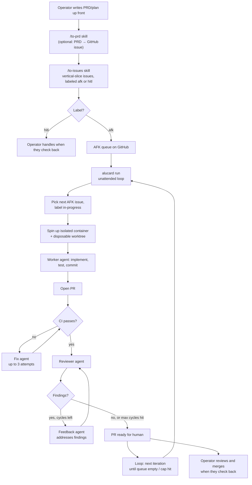

# Alucard — autonomous worker loop

> **Experimental — personal project.** This is built for my own workflow and goals. It works for me but has no stability guarantees, no support commitment, and will change without notice. Use at your own risk.

## What it is

A containerized agent loop that picks GitHub issues off a queue, completes them one at a time in isolated git clones, opens PRs, and runs unattended in the background. Workflow:

1. **You (the operator) write a PRD or plan** up front. This is the 80% of the work.
2. **`/to-issues` skill** breaks the plan into vertical-slice GitHub issues, labeled `afk` (autonomous-doable) or `hitl` (needs human).
3. **Alucard runs unattended** — pulls the AFK queue, picks one, implements, tests, commits, opens a PR, repeats until queue empty or iteration cap hit.
4. **CI gate** — after a PR is opened, polls CI and launches a fix agent (up to 3 attempts) if checks fail.
5. **Review gate** — runs a reviewer agent to evaluate the PR, then a feedback agent to address findings; repeats up to `--max-review-cycles` times (default 10). The loop ends early on `APPROVED` or `BLOCKED` (see [Loop convergence](#loop-convergence)).
6. **You review PRs when you check back** and merge what's good.

Before the first iteration, a **toolchain preflight** checks that the container can actually install the target repo's dependencies (`uv sync` / `npm ci`, detected at the repo root or one level down). The result is printed at startup, saved to `toolchain-preflight.txt` in the log directory, and passed to every reviewer.

The image is stamped with a hash of the `Dockerfile` and `entrypoint.sh` that built it, and rebuilt automatically when they change — an existing tag is not proof the image is current, and a Dockerfile fix sitting inert behind a cached tag is how the toolchain stayed broken for 25 review cycles. `--no-build` warns instead.

Alucard never pushes to main. Each iteration produces an independent PR.

## Flow



## Architecture

- **CLI / host orchestrator** (`alucard`) — bash CLI that loops, manages isolated git clones on the host, queries the GitHub issue queue, and shells out to `docker run` per iteration.
- **Container** (Dockerfile + entrypoint) — disposable per agent run. Runs `claude` CLI in headless mode with broad permissions but bounded by kernel-level isolation. Spun up separately for the main worker, CI fix agents, reviewer agents, and feedback agents.
- **Agent prompts** — one file per role: `alucard-worker-prompt.md` (main worker — mode-agnostic core, assembled at dispatch with `alucard-worker-github-prompt.md` or `alucard-worker-local-prompt.md` depending on the task source), `alucard-reviewer-prompt.md` (code reviewer), `alucard-ci-fix-prompt.md` (CI failure fixer), `alucard-feedback-prompt.md` (review feedback handler).
- **Skills** (`/to-prd`, `/to-issues`) — Claude Code skills used during PRD authoring and issue breakdown. Vendored under `.claude/skills/` in this repo and copied into each target repo's `.claude/skills/` at setup time so the operator can invoke them while working there.

## Loop convergence

The review gate can end four ways:

| Verdict | What it means | What happens |
|---|---|---|
| `APPROVED` | Nothing merge-blocking left. | Loop ends, PR ready to merge. |
| `CHANGES_REQUESTED` | Merge-blocking issues **a feedback agent can fix in the container**. | Feedback agent runs, then the next cycle. |
| `BLOCKED` | Code work is done; merge is gated on something no agent can do — a human-only acceptance criterion, a live deploy, a credential the container does not hold. | Loop ends, PR labeled `needs-human`, reviewer's reasoning posted. |
| *(cycles exhausted)* | The loop hit `--max-review-cycles`. | PR left open for manual review. |

Without `BLOCKED`, the loop had only two ends — approval or exhaustion — so a finding no agent could act on was re-reported until the budget ran out. The failure mode this fixes ([zodiac#40](https://github.com/aldovc/zodiac/pull/40)): 25 review cycles across 4 runs, ~20 of them re-reporting the same "trigger the Cloud Scheduler job manually and attach production evidence" finding into a container with no `gcloud`. Zero approvals, and the feedback agent eventually drifted into rewriting unrelated production logic because that was the only thing it *could* change.

Three mechanisms keep the loop converging:

- **Blocked-findings ledger.** When the feedback agent hits a finding it cannot action, it writes `/work-output/.alucard-blocked` instead of posting a "blocked" comment. The harness posts that once as a `**🤖 Alucard blocked findings**` marker comment and feeds it to every later reviewer as `<known_blockers>`, which they are instructed not to re-report. The ledger is reloaded from the PR at the start of each run, so a re-run does not rediscover it.
- **Reviewers read the conversation.** Each reviewer reads prior cycles' findings and the feedback agent's replies before judging, so a finding already fixed or already recorded as blocked is not raised again at a new line number.
- **Toolchain status.** Reviewers are told whether the container can install dependencies at all. When it cannot, they review the tests as written but do not demand test *output* no agent on the PR could produce.

## Threat model and safety design

**The risk:** `claude` runs in `bypassPermissions` mode (no prompts, full tool access) so the agent doesn't get stuck mid-run on a missing tool permission. Without isolation, a confused or prompt-injected agent could `rm -rf` your home directory or exfiltrate credentials.

**The defenses, layered:**

1. **Kernel boundary (primary):** Docker container with `--read-only` root, `--cap-drop ALL`, `--security-opt no-new-privileges`, dedicated unprivileged user. Filesystem damage is bounded to the bind-mounted worktree directory. The host's `/home`, `/etc`, dotfiles, and other repos are unreachable.
2. **Resource caps:** `--memory 4g --cpus 2` — runaway loops can't OOM the host.
3. **Disposable worktrees:** Each iteration gets a fresh worktree at `${REPO}/.alucard-worktrees/iter-N`. Orchestrator removes it after each iteration. `EXIT` trap handles interrupted runs.
4. **PR-only output:** Agent never pushes to main. Branch protection on main as belt-and-suspenders.
5. **Credential scoping:** GitHub token is fine-grained PAT, single repo, 30-day expiry. Anthropic key is dedicated worker key with monthly budget cap set in the console.
6. **Pattern blacklist (last line):** `--disallowedTools` removes obvious foot-guns like `rm -rf /*`, `sudo`, `curl | sh`. Pattern-matching is leaky but cheap.
7. **Hard caps per iteration:** `--max-turns 180`, `--max-budget-usd 5`, `timeout 30m`. Fix/reviewer/feedback agents use lower caps (`--max-turns 20-30`, `--max-budget-usd 2`).

**What's still possible:** credential exfiltration via network. Bounded by token scoping — worst case is "attacker gets push access to one repo for up to 30 days," which is recoverable.

## File layout

```
alucard/
├── README.md                    # this file
├── alucard                      # CLI
├── Dockerfile                   # node:24.14.0-slim + git + gh + claude code + alucard user
├── entrypoint.sh                # configures git identity and gh auth at container start
├── alucard-worker-prompt.md     # worker agent instructions (mode-agnostic core)
├── alucard-worker-github-prompt.md  # worker mode section: GitHub issues queue
├── alucard-worker-local-prompt.md   # worker mode section: local tasks file
├── alucard-reviewer-prompt.md   # reviewer agent instructions
├── alucard-ci-fix-prompt.md     # CI-fix agent instructions
├── alucard-feedback-prompt.md   # review-feedback agent instructions
├── alucard.env.example          # template for credentials (real one is gitignored)
├── test/                        # bash unit tests — `for t in test/*.sh; do bash "$t"; done`
├── .claude/
│   └── skills/
│       ├── to-prd/SKILL.md      # vendored — copy into target repo
│       └── to-issues/SKILL.md   # vendored — copy into target repo
└── .gitignore                   # ignores alucard.env and logs/
```

The target repo (the one Alucard works on) needs:

```
target-repo/
├── .gitignore                   # add: .alucard-worktrees/
├── .claude/
│   └── skills/
│       ├── to-prd/
│       │   └── SKILL.md         # copy from alucard/.claude/skills/to-prd/
│       └── to-issues/
│           └── SKILL.md         # copy from alucard/.claude/skills/to-issues/
└── (your code)
```

Alucard tooling is designed to live in a separate folder so it is reusable across projects. Point the CLI at a target repo with a positional path, `--repo`, or `ALUCARD_TARGET_REPO`.

## Local task source

GitHub issues are the default queue, but Alucard can also read tasks from a plain markdown file — no issue tracker, no per-repo labels, no `Issues` PAT scope. Useful for personal repos where opening a GitHub issue per planning slice is more ceremony than the work deserves.

### Format

One file per plan, by default `.alucard/tasks.md` inside the target repo (gitignored — a host-side ledger, never committed or pushed). Everything above the first task heading is the plan's shared **parent context**, injected verbatim into every worker and reviewer prompt so individual tasks stay terse without drifting from the plan. Each `## [<state>] <id>: <title>` heading starts a task; everything until the next task heading is its free-form body.

States:

| State | Meaning |
|-------|---------|
| `[ ]` | Queued — eligible for the next iteration |
| `[>]` | PR in flight — the harness appends `(PR #N)` to the title when it dispatches the task |
| `[x]` | Done |
| `[h]` | Human task (HITL) — never queued, but kept in the file so the whole plan lives in one artifact |

A task can declare dependencies with a bare `Blocked by:` line in its body (comma-separated task ids, or `none`); the harness also honors the legacy `Blocked by #N` GitHub-issue form (an open blocker issue keeps the task blocked). File order is queue order — reprioritizing is moving lines, not relabeling.

**Worked example** (`.alucard/tasks.md`):

```markdown
# Widget export — CSV and JSON

Ship a CSV/JSON export for the widget list. Reuse the existing
`/api/widgets` endpoint; no new query params beyond `format`.

## [ ] 1: Add `format` query param and CSV/JSON serializers

## What to build

Extend `/api/widgets/export` to accept `?format=csv|json`.

## Acceptance criteria

- [ ] `?format=json` returns the existing JSON shape unchanged
- [ ] `?format=csv` returns a CSV with a header row

Blocked by: none

## [h] 2: Decide whether export is rate-limited

Large lists could make this endpoint expensive — cap, paginate, or rate-limit?

Blocked by: none

## [ ] 3: Add a "Download" button

Blocked by: 1
```

`alucard queue` against this file returns exactly task `1` — task `2` is HITL (never queued) and task `3` stays blocked until task `1` reaches `[x]`.

### Flags and auto-detection

- `--tasks PATH` / `ALUCARD_TASKS_FILE` — use this tasks file instead of the GitHub queue.
- Auto-detect: with neither flag set, `alucard` looks for `.alucard/tasks.md` in the target repo and switches to it automatically.
- `--github` — force the GitHub issue queue even when a local tasks file is present or configured. Combining `--tasks` and `--github` is an error.
- `alucard doctor` validates the file structurally (duplicate ids, dangling `Blocked by:` references, empty header, malformed headings) with line numbers, before a run ever starts.

### Lifecycle / morning-after flow

- Each iteration, the harness picks the first eligible (`[ ]`, unblocked) task itself and hands the worker exactly that one task plus the parent context — no queue to pick from, so bundling is structurally impossible.
- There is no claim/label step in local mode — no `in-progress` label. Runs are sequential, so nothing else can grab the same task mid-run. Local task blockers should use task ids (`Blocked by: 1, 2`); legacy `Blocked by #N` issue blockers still require `gh issue view` access so open GitHub issues can keep tasks blocked.
- When a PR opens, the harness flips the task's heading from `[ ]` to `[>] … (PR #N)` — a single atomic line edit.
- The PR body's first line is `Task: <id>`, never a GitHub closing keyword — task ids aren't issue numbers, and a stray `Closes #N` would close an unrelated issue in the target repo.
- Reconciling a `[>]` task's outcome back into the file (merged → `[x]`, closed unmerged → back to `[ ]` with a pointer to the failed attempt) is not automatic yet — until it is, flip the heading to `[x]` by hand once you've merged the PR, so anything blocked on that task unblocks on the next run.
- `alucard queue` shows exactly what the next iteration would pick up at any time — the file doubles as the morning-after dashboard.

### Reduced PAT scope

Local mode can run without the GitHub Issues API when local tasks use task-id blockers exclusively (`Blocked by: 1, 2`). In that case, the fine-grained PAT described in [Credentials to provision](#credentials-to-provision) needs only **Contents R/W, Pull requests R/W, Metadata R** — drop `Issues R/W`. If any local task uses the legacy `Blocked by #N` GitHub-issue form, keep **Issues read** access so the queue can resolve whether that issue is still open.

## Setup checklist for the new folder

### Prerequisites on the host

- Docker installed and the user in the `docker` group (or `sudo` available)
- `git`, `gh`, `jq` installed on host (host orchestrator uses them for queue inspection)
- `gh auth login` already done as the human user (separate from the container's auth)
- The target repo cloned locally with at least one commit on `main` and a remote on GitHub

### Install the CLI

```bash
curl -fsSL https://raw.githubusercontent.com/aldovc/alucard/main/install.sh | bash
```

This clones the repo into `~/.local/share/alucard`, symlinks the `alucard` CLI into `~/.local/bin`, and writes a credential template to `~/.local/share/alucard/alucard.env`. Override defaults with env vars:

```bash
ALUCARD_HOME=~/tools/alucard ALUCARD_BIN_DIR=~/bin curl -fsSL https://raw.githubusercontent.com/aldovc/alucard/main/install.sh | bash
```

Re-run the same command to update an existing install.

The rest of this README uses `$ALUCARD_HOME` for the install path (`~/.local/share/alucard` by default).

Use it from anywhere:

```bash
alucard run /path/to/target-repo --iterations 1 --timeout-minutes 10
alucard queue /path/to/target-repo
alucard doctor /path/to/target-repo
```

### Credentials to provision

Create the local env file:

```bash
cp "$ALUCARD_HOME/alucard.env.example" "$ALUCARD_HOME/alucard.env"
```

1. **GitHub fine-grained PAT:**
   - github.com → Settings → Developer settings → Personal access tokens → Fine-grained
   - Repository access: only the target repo
   - Permissions: Contents R/W, Issues R/W, Pull requests R/W, Metadata R
   - Expiry: 30 days
   - Paste into `alucard.env` as `GITHUB_TOKEN=`
   - **Note:** Fine-grained PATs cannot access the GitHub GraphQL `statusCheckRollup` field — GitHub has not shipped a "Checks" permission for fine-grained tokens ([known limitation](https://github.com/cli/cli/issues/12597)). Alucard detects this and falls back to polling `gh run list`, which works correctly. If you want the primary `gh pr checks --watch` path, use a **classic PAT with `repo` scope** instead.
   - **Local task source:** running a repo exclusively off a [local tasks file](#local-task-source) instead of GitHub issues needs only Contents R/W, Pull requests R/W, Metadata R — drop `Issues R/W` only when local tasks use task-id blockers exclusively. Keep Issues read access for legacy `Blocked by #N` issue blockers.

2. **Anthropic worker API key:**
   - console.anthropic.com → API keys → create new key named "alucard-worker"
   - In the workspace settings, set a monthly spend cap (e.g. $50)
   - Paste into `alucard.env` as `ANTHROPIC_API_KEY=`

### One-time setup commands in target repo

```bash
# Add gitignores
cat >> .gitignore <<'EOF'
.alucard/tasks.md
.alucard-worktrees/
EOF

# Create labels
for L in afk hitl in-progress wip tracer-bullet alucard; do
  gh label create "$L" --force
done

# Branch protection on main (via gh or GitHub UI):
# Require PR, require status checks, no direct pushes
gh api -X PUT "repos/{owner}/{repo}/branches/main/protection" \
  --input - <<'EOF'
{
  "required_status_checks": null,
  "enforce_admins": false,
  "required_pull_request_reviews": {"required_approving_review_count": 0},
  "restrictions": null
}
EOF
```

### The `/to-prd` and `/to-issues` skills

Both skills are vendored in this repo under `alucard/.claude/skills/`. Copy them into the target repo:

```bash
mkdir -p /path/to/target-repo/.claude/skills
cp -r "$ALUCARD_HOME/.claude/skills/to-prd" /path/to/target-repo/.claude/skills/
cp -r "$ALUCARD_HOME/.claude/skills/to-issues" /path/to/target-repo/.claude/skills/
```

- `/to-prd` — synthesize the current conversation into a PRD and open it as a GitHub issue.
- `/to-issues` — break a PRD or plan into properly-labeled (`afk` / `hitl`) tracer-bullet issues that Alucard can pick up unattended. Publishes to GitHub issues by default, or to a [local tasks file](#local-task-source) — it asks which target when both are plausible.

### First smoke test

```bash
# Pull the pre-built image (default path)
docker pull ghcr.io/aldovc/alucard:latest

# Create one trivial AFK issue manually for the test
cd /path/to/target-repo
gh issue create --label afk --label tracer-bullet \
  --title "Add a CHANGELOG.md" \
  --body "## Type
AFK

## What to build
Create a CHANGELOG.md at repo root with a Keep a Changelog template.

## Acceptance criteria
- [ ] CHANGELOG.md exists at repo root
- [ ] Contains 'Unreleased' section header
- [ ] Linked from README.md

## Blocked by
None — can start immediately"

# Run one iteration with a 10-min cap and watch
"$ALUCARD_HOME/alucard" run /path/to/target-repo -n 1 -t 10
```

If a PR appears within 10 minutes, the setup works. If not, check `$ALUCARD_HOME/logs/alucard-*/iter-1.jsonl` for what the agent saw and did.

**Local/custom image:** if you need to modify the container, build locally and point Alucard at it:

```bash
# Build a local image with an explicit tag
"$ALUCARD_HOME/alucard" build --image myproject/alucard:dev

# Override the image for this run (or export it permanently)
ALUCARD_IMAGE=myproject/alucard:dev alucard run /path/to/target-repo -n 1 -t 15
```

`ALUCARD_IMAGE` overrides the default (`ghcr.io/aldovc/alucard:latest`) for any `alucard run` invocation.

## Open questions for the setup agent

These are choices the operator hasn't locked yet — surface them rather than guessing:

1. **Project toolchain in the Dockerfile.** The current Dockerfile has Node + git + gh + claude. If the target repo uses Python/uv/just/Rust/etc., those need to be added or the agent will fail to run `just test`.
2. **Branch protection enforcement.** Do you want admin enforcement on, or off so you can hotfix? Default off is fine for solo work.
3. **Notification on completion.** Currently the loop just exits. You might want a Telegram/Discord ping when the run finishes.
4. **Concurrent iterations.** Current design is sequential — one container at a time. If you want parallel workers picking different issues, the `in-progress` label coordination needs to handle race conditions (gh API isn't atomic for label-add). Don't add unless asked.
5. **Two-identity reviewer (deferred).** Right now the worker, reviewer, fix, and feedback agents all share one `GITHUB_TOKEN`. GitHub blocks formal `gh pr review --approve` / `--request-changes` when the PR author and reviewer are the same identity (this is a hardcoded product rule — not configurable in branch protection, repo, or org settings). Consequence: the reviewer can only post audit comments via the shell wrapper, which don't satisfy branch-protection "require N approvals" rules. To enable real approval-gated merging, split into two identities:
   - `GITHUB_TOKEN` (worker) — opens PRs, pushes commits, comments on issues. Used by worker, fix, and feedback agents.
   - `GITHUB_REVIEWER_TOKEN` (reviewer) — separate PAT or GitHub App installation token, scoped to PR-read + PR-review write on the target repo. Used only by the reviewer agent's container.

   Plumbing sketch when implemented:
   - Add `GITHUB_REVIEWER_TOKEN=` to `alucard.env.example` and the docs above.
   - In `alucard`, the reviewer `docker run` block (around the `--name "alucard-review-…"` invocation) overrides `GITHUB_TOKEN` with the reviewer token: drop `--env-file` for `GITHUB_TOKEN` and pass `-e GITHUB_TOKEN="$GITHUB_REVIEWER_TOKEN"` explicitly. Worker/fix/feedback blocks stay unchanged.
   - Restore `gh pr review --approve` / `--request-changes` as primary in `alucard-reviewer-prompt.md` (the dedup logic in the shell already prefers a formal review over the decision file).
   - Remove the defensive comment at `alucard:679–686` that distrusts file-based APPROVED — once formal reviews work, the file fallback is no longer the only path.

## Quick-reference commands

```bash
# Pull the latest pre-built image
docker pull ghcr.io/aldovc/alucard:latest

# Build a local custom image
alucard build

# Run unattended (20 iterations max, 30 min each) — uses ghcr.io/aldovc/alucard:latest by default
alucard run /path/to/target-repo -n 20 -t 30

# Run one iteration to test
alucard run /path/to/target-repo -n 1 -t 15

# Check what's in the queue right now
alucard queue /path/to/target-repo

# Run against a local tasks file instead of GitHub issues
alucard run /path/to/target-repo --tasks /path/to/target-repo/.alucard/tasks.md -n 1 -t 15

# Validate a tasks file (duplicate ids, dangling blockers, malformed headings)
alucard doctor /path/to/target-repo

# Manually un-stick an issue if Alucard crashed mid-task
gh issue edit <N> --remove-label in-progress

# Prune leftover clones if the orchestrator was hard-killed
rm -rf .alucard-worktrees/

# Watch a live run
tail -f "$ALUCARD_HOME"/logs/alucard-*/iter-*.jsonl | jq -r 'select(.type=="assistant").message.content[]?.text // empty'

# Reconstruct an overnight run — one timestamped line per run/iteration/gate transition
cat "$ALUCARD_HOME"/logs/alucard-*/events.log
```

## Releases

```bash
# Tag and publish a new release
git tag v0.2.0
git push --tags
```

The push triggers `.github/workflows/docker-publish.yml`, which builds and publishes:

| Image tag | Meaning |
|-----------|---------|
| `ghcr.io/aldovc/alucard:vX.Y.Z` | Exact release — pinned, reproducible |
| `ghcr.io/aldovc/alucard:vX.Y` | Floating minor — patch updates only |
| `ghcr.io/aldovc/alucard:vX` | Floating major — any compatible update |
| `ghcr.io/aldovc/alucard:latest` | Tracks `main` — unpinned |
| `ghcr.io/aldovc/alucard:<short-sha>` | Every push, for debugging |

`:latest` is also updated on every tag push — it always points to the most recently published image (tag or main push, whichever came last).

**Pinning:** operators who want reproducible runs can set `ALUCARD_IMAGE=ghcr.io/aldovc/alucard:v0.1.0`. `:latest` stays the default.

**CLI version:** `alucard version` (or `alucard --version`) prints the version derived from `git describe` against the CLI source directory. On a tagged checkout it shows `v0.1.0`; on a post-tag commit, `v0.1.0-3-gabc1234`; on an untagged tree, the short SHA.

## Acknowledgements

The `/to-prd` and `/to-issues` skills vendored in this repo are sourced from [mattpocock/skills](https://github.com/mattpocock/skills).

## Design references for the setup agent

The full design conversation that produced this is summarized as:
- **Worker loop** based on the "ralph" pattern (issues-as-queue, agent-as-worker, sentinel-for-termination), hardened to use bash-side queue filtering rather than model-side, PRs not main, worktree isolation per iteration, hard timeouts and budget caps.
- **Issue creation** via `/to-issues` skill that produces vertical tracer-bullet slices, AFK/HITL labeled, with size constraints (~10 files / ~30 minutes per AFK slice) and explicit blocker tracking via `Blocked by #N` body convention.
- **Containerization** chosen over unprivileged-user-only after weighing the threat model — kernel boundary is the only real defense against `rm -rf /`, and the operational cost is low for a single-machine homelab setup.
